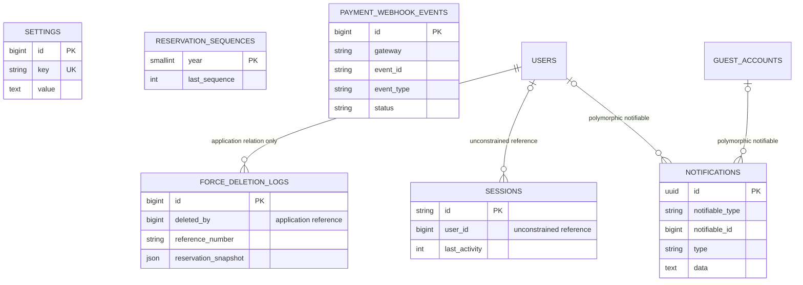

# UHLMS database ERD

For field-level definitions, see the [UHLMS database dictionary](./UHLMS_DATABASE_DICTIONARY.md).

This is the Crow's Foot entity relationship diagram for the current `uhlms`
database. It reflects the live MySQL foreign-key constraints checked on
2026-08-14. Timestamps and non-relational implementation columns are omitted
unless they help identify an entity; see the migrations and the companion
database dictionary for the complete field-level reference.

## Operational database

```mermaid
erDiagram
    USERS {
        bigint id PK
        string name
        string email UK
        string role
    }

    GUEST_ACCOUNTS {
        bigint id PK
        string name
        string email UK
        string phone
        string gender
        smallint age
        timestamp disabled_at
    }

    FLOORS {
        bigint id PK
        string name
        int level
        boolean is_active
    }

    ROOM_TYPES {
        bigint id PK
        string name
        decimal base_rate
        enum pricing_type
        enum room_sharing_type
        json images
        boolean is_active
    }

    ROOMS {
        bigint id PK
        bigint room_type_id FK
        bigint floor_id FK
        string room_number UK
        int capacity
        enum status
        boolean is_active
    }

    AMENITIES {
        bigint id PK
        string name
        boolean is_active
    }

    AMENITY_ROOM_TYPE {
        bigint id PK
        bigint amenity_id FK
        bigint room_type_id FK
    }

    SERVICES {
        bigint id PK
        string code UK
        string name
        string category
        decimal price
        boolean is_active
    }

    RESERVATIONS {
        bigint id PK
        string reference_number UK
        bigint guest_account_id FK
        bigint preferred_room_type_id FK
        bigint billing_guest_id FK
        bigint reviewed_by FK
        date check_in_date
        date check_out_date
        int number_of_occupants
        enum status
        decimal balance_due
        string payment_status
    }

    GUESTS {
        bigint id PK
        bigint reservation_id FK
        string first_name
        string last_name
        int age
        string gender
    }

    RESERVATION_ROOM_REQUESTS {
        bigint id PK
        bigint reservation_id FK
        bigint room_type_id FK
        smallint requested_room_count
        smallint requested_capacity
        smallint occupant_count
    }

    RESERVATION_ALTERNATIVE_OFFERS {
        bigint id PK
        bigint reservation_id FK
        bigint reservation_room_request_id FK
        bigint offered_room_type_id FK
        bigint proposed_by FK
        json room_ids
        decimal quoted_total
        string status
        timestamp expires_at
    }

    ROOM_HOLDS {
        bigint id PK
        bigint room_id FK
        bigint reservation_id FK
        date hold_from
        date hold_to
        string hold_type
        smallint held_guest_count
        timestamp expires_at
    }

    ROOM_ASSIGNMENTS {
        bigint id PK
        bigint reservation_id FK
        bigint guest_id FK
        bigint room_id FK
        bigint assigned_by FK
        bigint checked_in_by FK
        bigint checked_out_by FK
        enum status
        timestamp assigned_at
    }

    CHECK_IN_SNAPSHOTS {
        bigint id PK
        bigint reservation_id FK
        bigint guest_id FK
        bigint captured_by FK
        datetime detailed_checkin_datetime
        datetime detailed_checkout_datetime
    }

    RESERVATION_CHARGES {
        bigint id PK
        bigint reservation_id FK
        bigint created_by FK
        string charge_type
        decimal qty
        decimal unit_price
        decimal amount
    }

    RESERVATION_PAYMENTS {
        bigint id PK
        bigint reservation_id FK
        bigint received_by FK
        decimal amount
        string payment_mode
        string gateway_payment_id UK
        string status
    }

    RESERVATION_FEEDBACK {
        bigint id PK
        bigint reservation_id FK, UK
        bigint guest_account_id FK
        bigint reviewed_by FK
        tinyint overall_rating
        string status
        string visibility_status
    }

    RESERVATION_LOGS {
        bigint id PK
        bigint reservation_id FK
        string event
        bigint actor_id
        timestamp logged_at
    }

    SUPPORT_INQUIRIES {
        bigint id PK
        bigint guest_account_id FK
        bigint handled_by FK
        string category
        string subject
        string status
        string priority
    }

    SUPPORT_INQUIRY_REPLIES {
        bigint id PK
        bigint support_inquiry_id FK
        bigint user_id FK
        bigint guest_account_id FK
        text message
    }

    TOUR_WAYPOINTS {
        bigint id PK
        bigint linked_room_type_id FK
        bigint linked_room_id FK
        string name
        string slug UK
        enum type
        string panorama_image
        boolean is_active
    }

    TOUR_HOTSPOTS {
        bigint id PK
        bigint waypoint_id FK
        string title
        enum action_type
        string action_target
        boolean is_active
    }

    FLOORS ||--o{ ROOMS : contains
    ROOM_TYPES ||--o{ ROOMS : classifies
    AMENITIES ||--o{ AMENITY_ROOM_TYPE : has
    ROOM_TYPES ||--o{ AMENITY_ROOM_TYPE : includes

    GUEST_ACCOUNTS o|--o{ RESERVATIONS : owns
    ROOM_TYPES o|--o{ RESERVATIONS : preferred_for
    USERS o|--o{ RESERVATIONS : reviews
    RESERVATIONS ||--o{ GUESTS : includes
    GUESTS o|--o{ RESERVATIONS : bills

    RESERVATIONS ||--o{ RESERVATION_ROOM_REQUESTS : requests
    ROOM_TYPES ||--o{ RESERVATION_ROOM_REQUESTS : requested_as
    RESERVATIONS ||--o{ RESERVATION_ALTERNATIVE_OFFERS : receives
    RESERVATION_ROOM_REQUESTS o|--o{ RESERVATION_ALTERNATIVE_OFFERS : answers
    ROOM_TYPES ||--o{ RESERVATION_ALTERNATIVE_OFFERS : offered_as
    USERS o|--o{ RESERVATION_ALTERNATIVE_OFFERS : proposes

    RESERVATIONS ||--o{ ROOM_HOLDS : holds
    ROOMS ||--o{ ROOM_HOLDS : is_held
    RESERVATIONS ||--o{ ROOM_ASSIGNMENTS : assigns
    GUESTS o|--o{ ROOM_ASSIGNMENTS : occupies
    ROOMS ||--o{ ROOM_ASSIGNMENTS : assigned
    USERS ||--o{ ROOM_ASSIGNMENTS : assigned_by
    USERS o|--o{ ROOM_ASSIGNMENTS : checked_in_by
    USERS o|--o{ ROOM_ASSIGNMENTS : checked_out_by

    RESERVATIONS ||--o{ CHECK_IN_SNAPSHOTS : snapshots
    GUESTS o|--o{ CHECK_IN_SNAPSHOTS : captured_for
    USERS o|--o{ CHECK_IN_SNAPSHOTS : captures
    RESERVATIONS ||--o{ RESERVATION_CHARGES : accrues
    USERS o|--o{ RESERVATION_CHARGES : creates
    RESERVATIONS ||--o{ RESERVATION_PAYMENTS : receives
    USERS o|--o{ RESERVATION_PAYMENTS : receives_for
    RESERVATIONS ||--o| RESERVATION_FEEDBACK : has
    GUEST_ACCOUNTS ||--o{ RESERVATION_FEEDBACK : submits
    USERS o|--o{ RESERVATION_FEEDBACK : reviews
    RESERVATIONS ||--o{ RESERVATION_LOGS : records

    GUEST_ACCOUNTS o|--o{ SUPPORT_INQUIRIES : opens
    USERS o|--o{ SUPPORT_INQUIRIES : handles
    SUPPORT_INQUIRIES ||--o{ SUPPORT_INQUIRY_REPLIES : has
    USERS o|--o{ SUPPORT_INQUIRY_REPLIES : replies_as_staff
    GUEST_ACCOUNTS o|--o{ SUPPORT_INQUIRY_REPLIES : replies_as_guest

    ROOM_TYPES o|--o{ TOUR_WAYPOINTS : linked_to
    ROOMS o|--o{ TOUR_WAYPOINTS : linked_to
    TOUR_WAYPOINTS ||--o{ TOUR_HOTSPOTS : contains
```

## Independent, framework, and polymorphic tables

The remaining tables (`cache`, `cache_locks`, `jobs`, `job_batches`,
`failed_jobs`, `migrations`, `password_reset_tokens`, and
`guest_password_reset_tokens`) are Laravel infrastructure tables with no
relationships in the live schema.

### Notation

`||` means exactly one, `o|` means zero or one, and `o{` means zero or many.
`FK` marks a database foreign key; the two explicitly labelled application or
polymorphic links are intentionally not enforced by MySQL.
