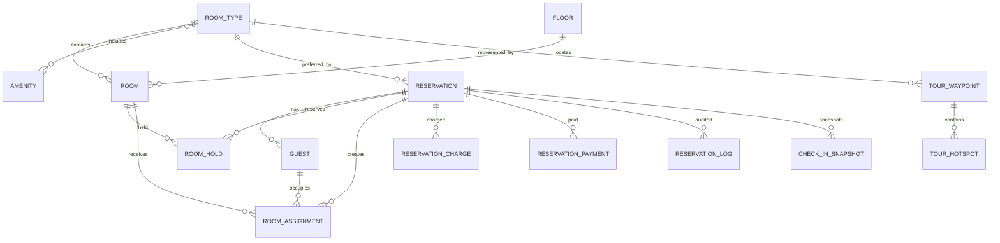
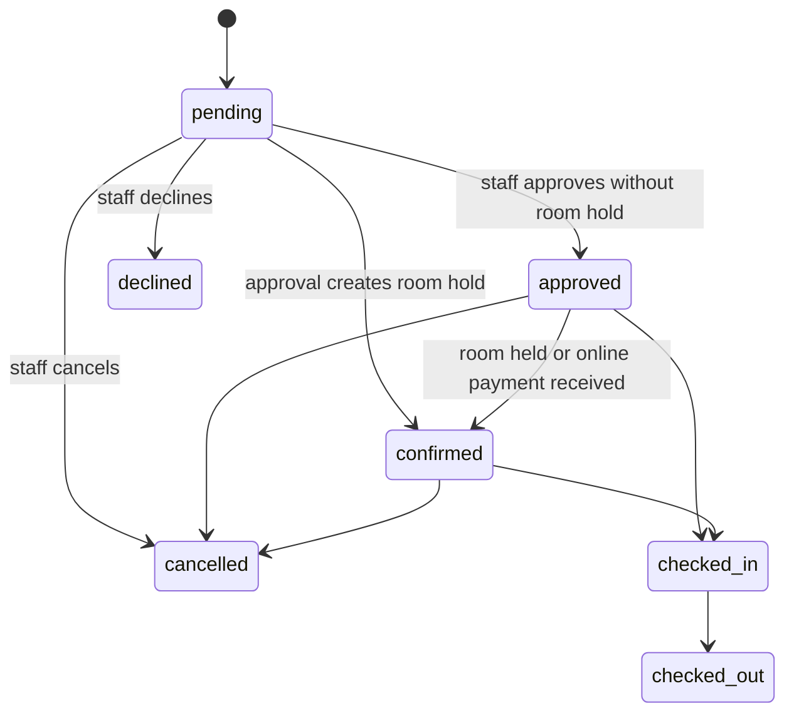

# UH Lodging Management System: Architecture and Code Tutorial

## 1. What this document explains

This document explains how the UH Lodging Management System (UHLMS) is structured, how its major workflows operate, why its important design choices make sense, and where the current implementation should be treated cautiously.

The codebase is substantially AI-assisted. That does not make it automatically good or bad, but it changes how it should be studied:

- Treat the running code and tests as the source of truth, not comments alone.
- Look for repeated business rules implemented in more than one place.
- Verify database portability instead of assuming Laravel abstractions were used everywhere.
- Distinguish intentional architecture from code that merely accumulated while features were added.
- Preserve working behavior before attempting broad refactors.

The best way to understand this project is not to read every file alphabetically. Follow the business lifecycle:

1. A guest browses room types.
2. The system calculates availability.
3. The guest submits a reservation request.
4. Staff reviews the request.
5. Staff approves it, optionally placing room holds.
6. The guest may pay online.
7. Reception checks the guest in and finalizes charges.
8. Staff checks the guest out.
9. Observers, notifications, logs, reports, and scheduled commands support the lifecycle.

---

## 2. The technology stack

### Backend

- PHP 8.2
- Laravel 11
- Eloquent ORM
- MySQL in the configured application environment
- Database-backed cache, sessions, and queues

### Staff interface

- Filament 3
- Livewire 3
- Filament database notifications
- Filament FullCalendar

### Guest interface

- Blade templates
- Tailwind CSS
- Alpine.js
- Vite

### Virtual tour

- Photo Sphere Viewer
- Three.js
- Gyroscope, marker, and stereo/VR-related plugins

### Integrations

- PayMongo hosted checkout and webhooks
- Brevo SMTP mail configuration
- Endroid QR Code
- PhpSpreadsheet for reports
- Spatie Honeypot for public reservation spam protection

### Why this stack fits

Laravel is a sensible foundation because this application is mostly data entry, workflow, authorization, reporting, and integrations. Filament greatly reduces the amount of custom admin CRUD code. Blade keeps the public pages simple, while JavaScript is concentrated in the virtual tour where richer interaction is genuinely needed.

The architecture is therefore not a single-page application. It is a server-rendered Laravel application with a specialized JavaScript subsystem for panoramic tours.

---

## 3. Repository structure

```text
app/
|-- Console/Commands/       Scheduled and maintenance commands
|-- Filament/               Staff/admin resources, pages, and widgets
|-- Http/Controllers/       Guest pages, tour APIs, payments, uploads
|-- Jobs/                   Queued webhook and database restore work
|-- Mail/                   Reservation and payment-link emails
|-- Models/                 Database entities and domain helpers
|-- Notifications/          Filament database notifications
|-- Observers/              Automatic reactions to model changes
|-- Policies/               Authorization rules
|-- Providers/              Application and Filament bootstrapping
|-- Services/               Reusable business workflows
`-- Support/                URL and settings helpers

database/
|-- migrations/             Database history and schema
`-- seeders/                Repeatable sample/current-state data

resources/
|-- css/                    Tailwind entry point
|-- js/                     Guest and virtual-tour JavaScript
`-- views/                  Blade and Filament views

routes/
`-- web.php                 Guest, tour, payment, webhook, and upload routes

tests/
|-- Feature/                End-to-end Laravel feature behavior
`-- Unit/                   Models, services, policies, observers, support
```

### The practical responsibility of each layer

| Layer | Main responsibility | Example |
|---|---|---|
| Route | Match an HTTP request to an action | `POST /reserve` |
| Controller | Validate HTTP input and prepare a response | `GuestController::reserveSubmit()` |
| Filament resource/page | Staff forms, tables, and actions | `ReservationResource` |
| Service | Reusable business transaction | `CheckInService` |
| Model | Data, relationships, small domain behavior | `Reservation::calculateDepositAmount()` |
| Observer | Side effects caused by model events | status email after reservation update |
| Job | Slow or retryable background work | payment webhook processing |
| Policy | Decide whether a staff user may act | `ReservationPolicy::update()` |
| Support helper | Infrastructure-specific formatting | `MediaUrl::url()` |

This separation is directionally good. The largest weakness is that some business calculations are duplicated between services and Filament pages, which can produce inconsistent results.

---

## 4. Application entry and request flow

Laravel is bootstrapped in `bootstrap/app.php`.

```php
return Application::configure(basePath: dirname(__DIR__))
    ->withRouting(
        web: __DIR__.'/../routes/web.php',
        commands: __DIR__.'/../routes/console.php',
        health: '/up',
    )
    ->withMiddleware(function (Middleware $middleware) {
        // ...
    })
    ->create();
```

### What this means

1. Laravel loads web routes from `routes/web.php`.
2. Console routes are loaded from `routes/console.php`.
3. `/up` is the health-check endpoint.
4. Middleware is configured centrally.

The same bootstrap file configures trusted proxies:

```php
$middleware->trustProxies(at: $trustedProxies ?: ['127.0.0.1', '::1']);
```

This matters for Cloudflare Tunnel. Laravel must trust the reverse proxy to correctly understand the original host, scheme, and client forwarding headers. Otherwise, HTTPS links can accidentally be generated as HTTP, or the application can misread the request host.

The PayMongo webhook is excluded from CSRF validation:

```php
$middleware->validateCsrfTokens(except: [
    '/api/webhooks/paymongo',
]);
```

That is necessary because PayMongo is an external server and cannot submit Laravel's browser-session CSRF token. Security is provided by webhook signature verification instead.

---

## 5. Route organization

The custom routes are in `routes/web.php`. There are four major groups.

### Guest pages

```php
Route::get('/', [GuestController::class, 'home'])->name('guest.home');
Route::get('/rooms', [GuestController::class, 'rooms'])->name('guest.rooms');
Route::get('/reserve', [GuestController::class, 'reserveForm'])->name('guest.reserve');
Route::post('/reserve', [GuestController::class, 'reserveSubmit'])
    ->middleware(['throttle:5,1', ProtectAgainstSpam::class])
    ->name('guest.reserve.submit');
```

The reservation submission is protected by:

- Laravel rate limiting: five attempts per minute.
- A honeypot: automated bots tend to fill hidden fields that real users never see.

### Tracking

```php
Route::get('/track', [GuestController::class, 'track'])
    ->middleware('throttle:10,1');

Route::get('/track/secure/{reservation}', [GuestController::class, 'trackSecure'])
    ->middleware(['signed', 'throttle:20,1']);
```

There are two tracking methods:

- Manual lookup using reference number and email.
- A temporary signed URL that cannot be modified without invalidating its signature.

### Virtual-tour API

```php
Route::prefix('api/tour')->group(function () {
    Route::get('/waypoints', [TourController::class, 'waypoints']);
    Route::get('/waypoint/{slug}', [TourController::class, 'waypoint']);
    Route::get('/room-type/{id}/availability', [TourController::class, 'roomTypeAvailability']);
    Route::post('/reserve', [TourController::class, 'reserveSubmit']);
});
```

These routes provide JSON to the JavaScript tour engine. They intentionally expose room-type availability rather than disclosing whether a specific physical room is vacant.

### Payments

```php
Route::get('/reserve/pay/{token}', [GuestPaymentController::class, 'showPaymentPage']);
Route::post('/reserve/pay/{token}', [GuestPaymentController::class, 'initializePayment']);
Route::post('/api/webhooks/paymongo', [PaymentWebhookController::class, 'handle']);
```

The browser starts payment through a tokenized reservation URL. The authoritative payment result arrives later through the webhook.

---

## 6. Core data model

The following conceptual diagram shows the important relationships.



### Why both `Reservation` and `Guest` exist

`Reservation` stores the booking-level primary contact and stay request. `Guest` stores actual people attached to the reservation.

This distinction is important because one reservation can contain several occupants, and those occupants can be distributed across several rooms.

### Why both `RoomHold` and `RoomAssignment` exist

- A `RoomHold` is future inventory protection before check-in.
- A `RoomAssignment` records an actual checked-in guest occupying a room.

Combining them into one table would make status interpretation harder. A future reservation is not the same thing as present occupancy.

### Why charges and payments are separate

`ReservationCharge` records what the guest owes:

- room rate
- add-on
- discount as a negative charge

`ReservationPayment` records money received:

- manual cash/payment
- PayMongo deposit
- PayMongo full payment
- check-in balance payment

The reservation summary is then:

```text
balance_due = sum(charges) - sum(posted payments)
```

This ledger approach is more auditable than storing only a mutable total.

---

## 7. Reservation identifiers

The `Reservation` model generates yearly reference numbers:

```php
DB::table('reservation_sequences')->upsert(
    ['year' => $currentYear, 'last_sequence' => 1],
    ['year'],
    ['last_sequence' => DB::raw('last_sequence + 1')]
);

$nextSequence = DB::table('reservation_sequences')
    ->where('year', $currentYear)
    ->value('last_sequence');

$reservation->reference_number =
    $currentYear.'-'.str_pad($nextSequence, 4, '0', STR_PAD_LEFT);
```

For example:

```text
2026-0001
2026-0002
2026-0003
```

### Why use a sequence table

An auto-incrementing reservation ID is an internal database key. It may be unattractive or reveal record volume. The separate yearly sequence creates a user-friendly reference.

The comment also states that deleted reservation numbers must not be reused. Keeping a permanent sequence counter supports that requirement.

### Caution

The code intends atomic allocation, but sequence behavior should be concurrency-tested against the production database. Reference generation is one of the places where a race condition would be operationally painful.

---

## 8. Guest room discovery

`GuestController::home()` and `GuestController::rooms()` load active room types and ask `RoomHoldService` for availability.

```php
$roomTypes = RoomType::where('is_active', true)
    ->with('amenities')
    ->get();

$roomHoldService = app(RoomHoldService::class);
```

The controller does not independently decide which rooms are available. That rule is delegated to a service so the homepage, room catalog, virtual tour, and approval workflow can share the same logic.

### Current availability versus date availability

```php
if ($checkIn && $checkOut) {
    $summary = $roomHoldService->getDateAvailabilitySummary(
        $roomType,
        $checkIn,
        $checkOut,
        $guests
    );
} else {
    $summary = $roomHoldService->getCurrentAvailabilitySummary(
        $roomType,
        $guests
    );
}
```

The result includes:

- available room count
- available bed count
- total room or bed count
- display label
- whether the requested guest count can be accommodated

### Private and public room types are calculated differently

For private rooms, the sale unit is a room.

```php
if ($roomType->isPrivate()) {
    $availableRoomsCount = $rooms
        ->filter(fn (Room $room) => $room->isAvailable())
        ->count();
}
```

For dormitory/public rooms, the sale unit is a bed:

```php
$availableSlots = max(0, $capacity - $reservedSlots);
$availableBedsCount = $roomAvailability->sum('available_slots');
```

This is an essential domain distinction:

- A private room becomes unavailable when occupied by one reservation.
- A dormitory can remain sellable until all beds are occupied or held.

---

## 9. Date-overlap logic

The room-hold conflict rule is:

```php
return $query
    ->where('hold_from', '<', $checkOut->toDateString())
    ->where('hold_to', '>', $checkIn->toDateString());
```

In plain language, two stays overlap when:

```text
existing start < requested end
AND
existing end > requested start
```

This uses half-open date intervals:

```text
[check-in, check-out)
```

That means a guest checking out on June 10 does not conflict with another guest checking in on June 10. This is the standard and correct hotel-booking interpretation.

### Conflict sources

`RoomHoldService::hasConflict()` checks:

1. Advance room holds.
2. Existing room assignments whose guests have not checked out and whose reservation dates overlap.

This prevents approval from holding a room that is already reserved or actively occupied.

### AI-assisted risk to notice

There are several availability methods with overlapping responsibilities:

- `hasConflict()`
- `getAvailableRooms()`
- `getReservedSlotsForDates()`
- `Room::isAvailable()`
- `Room::recalculateStatus()`

They are understandable, but the number of paths increases the chance of disagreement. Future changes should add focused tests before changing any of them.

---

## 10. Guest reservation submission

`GuestController::reserveSubmit()` follows a conventional sequence.

### Step 1: Validate

```php
$validated = $request->validate([
    'guest_last_name' => 'required|string|max:255',
    'guest_first_name' => 'required|string|max:255',
    'guest_email' => 'required|email|max:255',
    'preferred_room_type_id' => 'required|exists:room_types,id',
    'check_in_date' => 'required|date|after_or_equal:today',
    'check_out_date' => 'required|date|after:check_in_date',
    'number_of_occupants' => 'required|integer|min:1|max:20',
]);
```

Validation belongs near the HTTP boundary because it protects the application before invalid data reaches business logic.

### Step 2: Normalize

```php
$validated['guest_name'] = trim(
    $validated['guest_first_name'].' '.
    ($validated['guest_middle_initial'] ?? '').' '.
    $validated['guest_last_name']
);

$validated['status'] = 'pending';
```

The combined name is retained for backward compatibility and easy display, while separate name columns support structured forms.

### Step 3: Re-check availability

The browser's display is never trusted as the final authority. The server recalculates availability during submission.

If capacity is insufficient, the request can still be submitted, but the guest must explicitly acknowledge the warning.

This is a business choice: the application is a reservation-request system, not a fully automatic room-booking engine. Staff may be able to rearrange rooms or handle special circumstances.

### Step 4: Create

```php
$reservation = Reservation::create($validated);
```

Creating the model triggers:

- reference-number generation
- payment token generation
- reservation log creation
- staff notifications
- reservation-submitted email

Those side effects are attached through model boot methods and `ReservationObserver`.

### Step 5: Redirect to tracking

The user is redirected with the reference number and email in session flash data. This avoids showing a blank tracking page immediately after submission.

---

## 11. Reservation status workflow

The intended primary lifecycle is:



### Meaning of each status

| Status | Meaning |
|---|---|
| `pending` | Guest request awaits staff review |
| `approved` | Accepted, but no room hold is necessarily attached |
| `confirmed` | Stronger commitment, typically room held or payment received |
| `declined` | Staff rejected the request |
| `cancelled` | Previously valid request was cancelled |
| `checked_in` | One or more guests are actively assigned |
| `checked_out` | Stay has ended |

The service layer enforces allowed transitions:

```php
if ($reservation->status !== 'pending') {
    throw new RuntimeException(
        'Only pending reservations can be approved.'
    );
}
```

This is stronger than merely hiding a button. UI visibility is convenience; service validation is protection.

---

## 12. Staff approval and room holds

The approve button is defined in `ReservationResource`, but the workflow is executed by `ReservationWorkflowService`.

```php
$result = app(ReservationWorkflowService::class)
    ->approve($record, $data);
```

### What approval does

1. Ensures the reservation is pending.
2. Rotates and refreshes the guest payment token.
3. Changes status to approved.
4. Records reviewer information.
5. Optionally creates advance room holds.
6. Logs the action.

### Why room selection is optional

Some operations know the exact room during approval. Others assign a room only when the guest arrives. Supporting both avoids forcing staff into premature decisions.

### Hold creation

`RoomHoldService::createAdvanceHolds()`:

1. Verifies selected rooms belong to the requested room type.
2. Excludes inactive and maintenance rooms.
3. checks conflicts again.
4. Creates holds in a database transaction.
5. Moves `approved` to `confirmed`.

```php
DB::transaction(function () use (...) {
    foreach ($rooms as $room) {
        RoomHold::create([
            'room_id' => $room->id,
            'reservation_id' => $reservation->id,
            'hold_from' => $checkIn->toDateString(),
            'hold_to' => $checkOut->toDateString(),
            'hold_type' => 'advance',
        ]);
    }

    if ($reservation->status === 'approved') {
        $reservation->update(['status' => 'confirmed']);
    }
});
```

### Why a transaction is justified

All holds and the status update form one business operation. If one database write fails, partial holds should not remain.

### Concurrency caveat

The service checks conflicts before inserts, but the migration does not appear to enforce a database-level exclusion constraint for date ranges. Two simultaneous approval requests could theoretically pass the conflict check before either inserts. MySQL does not make interval exclusion trivial, so robust handling would require locking or another serialized allocation strategy.

---

## 13. Online payment flow

Online payment is feature-toggled through the `settings` table.

```php
if (! Setting::isOnlinePaymentsEnabled()) {
    abort(404, 'Online payments are not available.');
}
```

### Why use a setting instead of only `.env`

An administrator can enable or disable payments through the application without editing server configuration. `.env` still holds secrets, while the database setting controls business availability.

### Payment-link security

Each reservation receives:

- a UUID token
- an expiry timestamp

```php
public function issueGuestPaymentLink(
    bool $rotateToken = false,
    ?Carbon $expiresAt = null
): self {
    if ($rotateToken || empty($this->payment_link_token)) {
        $this->payment_link_token = (string) Str::uuid();
    }

    $this->payment_link_expires_at =
        $expiresAt ?? now()->addHours(48);

    return $this;
}
```

The token avoids exposing sequential reservation IDs and can be rotated after approval.

### Checkout initialization

`GuestPaymentController::initializePayment()`:

1. Confirms payments are enabled.
2. Finds the reservation by token.
3. checks token expiry.
4. ensures the reservation is approved or confirmed.
5. validates terms, method, and deposit/full choice.
6. calculates the amount.
7. creates a PayMongo Checkout Session.
8. stores a pending local payment.
9. redirects to PayMongo.

The success redirect is not treated as proof of payment. It only indicates that the browser returned.

---

## 14. Webhook processing and idempotency

`PaymentWebhookController` verifies the signature and immediately queues `ProcessPaymentWebhook`.

```php
if (! $gatewayService->verifyWebhookSignature(
    $payload,
    $signature ?? ''
)) {
    return response()->json(
        ['message' => 'Invalid signature'],
        401
    );
}

ProcessPaymentWebhook::dispatch($webhookData);
```

### Why return quickly

Payment providers expect webhook endpoints to acknowledge promptly. Expensive database and notification work is moved to a queue so PayMongo does not time out and retry unnecessarily.

### Signature verification

The code computes:

```text
HMAC-SHA256(timestamp + "." + raw request body, webhook secret)
```

It accepts PayMongo's test (`te`) or live (`v1`) signature component.

### Idempotency

Webhook providers may deliver the same event more than once. The job searches for an existing payment using:

- actual payment ID
- payment-intent ID
- source ID
- checkout-session ID

If a matching payment is already marked paid, processing stops.

```php
if (
    $existingPayment
    && $existingPayment->gateway_status === 'paid'
) {
    return;
}
```

This is essential. Without it, duplicate webhooks could post duplicate money.

### Status effect

An online payment can move:

```text
approved -> confirmed
```

It does not automatically check the guest in.

---

## 15. Check-in workflow

The check-in form is a custom Filament page:

```text
app/Filament/Resources/ReservationResource/Pages/CheckInGuest.php
```

The page gathers:

- primary guest details
- room entries
- additional occupants
- room mode
- identity information
- stay purpose
- discount flags
- add-ons
- payment data
- detailed check-in and checkout timestamps

The page delegates completion to:

```php
app(CheckInService::class)
    ->completeOnsiteCheckIn($this->record, $data);
```

### Why a service is necessary here

Check-in modifies many tables:

- guests
- room assignments
- room statuses
- reservation status
- room holds
- check-in snapshot
- charges
- payments
- logs

Keeping that inside a Filament button closure would be difficult to test and reuse.

### Primary guest normalization

The service guarantees that the primary guest appears in exactly one room entry.

```php
if (count($primaryIndices) > 1) {
    throw new RuntimeException(
        'Primary guest can only be included in one room entry.'
    );
}
```

This prevents the same person from being checked into multiple rooms accidentally.

### Private versus dorm assignment

For private rooms, the room is exclusive once guests are assigned.

For dormitories, each guest consumes one capacity slot:

```php
$currentOccupancy = $room->roomAssignments()
    ->where('status', 'checked_in')
    ->count();

if (
    $room->capacity > 0
    && $currentOccupancy >= $room->capacity
) {
    // reject this guest assignment
}
```

### Room status recalculation

`Room::recalculateStatus()` centralizes how the persisted room status follows actual occupancy.

Private:

```php
$newStatus = $checkedInCount > 0
    ? 'occupied'
    : 'available';
```

Dormitory:

```php
$newStatus =
    ($this->capacity > 0 && $checkedInCount >= $this->capacity)
        ? 'occupied'
        : 'available';
```

For dormitories, `available` means "still has a sellable bed," not "contains zero guests."

---

## 16. Check-in pricing and ledger creation

Pricing is based on:

- selected room entries
- private or dorm mode
- number of nights
- occupant count for dormitory/per-person entries
- add-ons and quantities
- eligible discount
- already-posted payments

### Room subtotal

```php
if ($roomMode === 'dorm') {
    $roomSubtotal +=
        $rate * max(1, $guestCount) * $nights;
} else {
    $roomSubtotal += $rate * $nights;
}
```

### Add-ons

```php
$servicesTotal = $additionalRequests->sum(
    fn ($item) =>
        (float) ($addonsById->get($item['code'])?->price ?? 0)
        * max(1, (int) ($item['qty'] ?? 1))
);
```

### Discount

The check-in service collects eligible discounts and applies only the highest configured percentage.

```php
usort(
    $candidates,
    fn ($a, $b) => $b['percent'] <=> $a['percent']
);

$best = $candidates[0];
```

This is a defensible policy because discounts often cannot be stacked.

### Existing payments

```php
$existingPayments = (float) $reservation->payments()
    ->where('status', 'posted')
    ->sum('amount');

$payable = max(0, $grossTotal - $existingPayments);
```

An online deposit therefore reduces the amount collected at reception.

### Ledger persistence

The service deletes and recreates charge rows during check-in finalization, while preserving gateway payments. This is intended to make finalization repeatable and avoid duplicate charge rows.

After creating charges and payments:

```php
$reservation->refreshFinancialSummary();
```

That recalculates:

- add-on total
- posted payment total
- remaining balance
- payment status

---

## 17. Check-in snapshots

`CheckInSnapshot` preserves a point-in-time summary of reception data.

Why keep a snapshot when assignments already contain similar fields?

- The reservation may have multiple assignments.
- Operational forms may be edited later.
- Reports may need the billing/primary guest's check-in details.
- A snapshot provides a stable record of what was captured at finalization.

There is deliberate duplication between `RoomAssignment` and `CheckInSnapshot`. This is denormalization for audit and reporting convenience, but it requires careful synchronization when edits are allowed.

`EditReservation::afterSave()` attempts that synchronization by updating assignments, snapshots, charges, and payments.

---

## 18. Checkout

Checkout is handled by `ReservationWorkflowService::checkOut()`.

```php
DB::transaction(function () use (...) {
    RoomAssignment::where('reservation_id', $reservation->id)
        ->whereNull('checked_out_at')
        ->get()
        ->each(fn (RoomAssignment $assignment) =>
            $assignment->update([
                'status' => 'checked_out',
                'checked_out_at' => $checkoutAt,
                'checked_out_by' => auth()->id(),
            ])
        );

    $reservation->update(['status' => 'checked_out']);
});
```

Each assignment update triggers `RoomAssignmentObserver`, which recalculates its room's status.

### Why close assignments individually

The room needs to become available only after its active assignments are closed. This is particularly important for dormitories where several guests may share a room.

---

## 19. Observers and automatic side effects

Observers are registered in `AppServiceProvider`.

```php
Reservation::observe(ReservationObserver::class);
Room::observe(RoomObserver::class);
RoomAssignment::observe(RoomAssignmentObserver::class);
```

### Reservation observer

Handles:

- initial payment-token issue
- creation log
- new-reservation staff notification
- submitted email
- status-change log
- status-change staff notification
- status-change email
- assignment cleanup when cancelled or declined
- room recalculation after deletion

### Room-assignment observer

Handles:

- room status after check-in
- guest check-in log
- staff notification
- room status after checkout
- guest checkout log
- cleanup after assignment deletion

### Benefits

Any code path that creates or updates these models receives the same side effects.

### Risks

Observers hide behavior. A simple:

```php
$reservation->update(['status' => 'cancelled']);
```

can also send notifications, send mail, update assignments, and write logs.

When debugging, always inspect registered observers before assuming a model operation is isolated.

---

## 20. Authorization

Users have:

- a role: `super_admin`, `admin`, or `staff`
- optional JSON custom permissions

`User::hasPermission()` applies this order:

1. Super admin always succeeds.
2. Custom permission JSON overrides defaults.
3. Otherwise, use role defaults.

```php
if ($this->isSuperAdmin()) {
    return true;
}

if ($this->permissions !== null) {
    return (bool) ($this->permissions[$key] ?? false);
}

return (bool) ($defaults[$key] ?? false);
```

Policies then translate permission keys into model actions:

```php
public function update(
    User $user,
    Reservation $reservation
): bool {
    return $user->hasPermission('reservations_edit');
}
```

### Why both roles and permissions

Roles provide convenient defaults. Per-user permissions support exceptions without inventing a new role for every variation.

### User-management protection

Non-super-admin users cannot inspect or modify administrator accounts. Users also cannot delete themselves. These rules reduce accidental lockout and privilege escalation.

---

## 21. Filament staff interface

`AdminPanelProvider` configures:

- `/admin`
- login and profile
- CMU branding
- navigation groups
- database notifications
- FullCalendar
- middleware and authentication
- session-expiry redirect behavior

Filament resources provide CRUD and workflow screens:

- reservations
- rooms
- room types
- floors
- amenities
- add-ons/services
- room holds
- users
- virtual-tour scenes

Custom pages provide:

- reports
- backup/restore
- guest-site settings
- payment settings
- discount settings
- permission reference
- deletion logs

### Why Filament is appropriate

The staff interface is mostly structured forms, filters, tables, actions, and reports. Filament supplies these patterns consistently and reduces custom frontend maintenance.

### Where complexity accumulated

`ReservationResource.php` is over two thousand lines. It contains:

- form schema
- infolist schema
- table columns
- filters
- actions
- pricing calculations
- discount presentation
- billing snapshot resolution

This is a strong candidate for gradual extraction into form schema classes, action classes, and a single pricing service.

---

## 22. Virtual-tour subsystem

### Data model

`TourWaypoint` represents a panoramic scene:

- name and slug
- panorama image
- thumbnail
- type
- default yaw, pitch, and zoom
- narration and description
- optional room-type link

`TourHotspot` represents an interactive marker:

- position
- icon and size
- title and description
- optional media
- action type
- action target

### Guest API

`TourController` converts Eloquent models into a stable JSON shape. That is preferable to returning models directly because it controls exactly what public users can see.

The API deliberately returns:

```php
'linked_room_type_id' =>
    $waypoint->linked_room_type_id
    ?: $waypoint->room?->room_type_id,

'linked_room_id' => null,
```

The physical room ID is suppressed. Guests see room-type inventory, which avoids exposing operational room-level availability.

### Frontend layers

```text
panorama-viewer.js
    Low-level wrapper around Photo Sphere Viewer and plugins

tour-engine.js
    Guest business interaction: scenes, hotspots, room info,
    availability, reservation modal, bookmarks, auto-tour

tour-editor.js
    Staff scene/hotspot editing behavior
```

This layering is good because renderer-specific code is separated from guest-tour workflow.

### Relative API paths

The tour engine defaults to:

```js
this.apiBase = options.apiBase || '/api/tour';
```

This is compatible with localhost and the Cloudflare hostname because the browser uses the current origin.

---

## 23. Guest-site settings

`GuestSiteSettings` wraps the generic `settings` table with:

- defaults
- boolean conversion
- JSON-array conversion
- media URL conversion

For example:

```php
if (in_array($key, static::BOOLEAN_KEYS, true)) {
    return filter_var($value, FILTER_VALIDATE_BOOLEAN);
}
```

This prevents the common PHP problem where the string `"0"` can be mishandled as configuration data.

The guest layout reads the settings and applies:

- branding
- announcement
- maintenance message
- high contrast
- large text
- configurable navigation labels
- configurable footer

The page remains server-rendered, so setting changes do not require rebuilding frontend assets.

---

## 24. Media URL strategy and dual-environment support

The project must support both localhost and the Cloudflare-hosted application.

`MediaUrl::url()` returns a relative URL for the local public disk:

```php
if (static::disk() === 'public') {
    return '/storage/'.ltrim($path, '/');
}
```

This is an important design choice. A relative URL works under both:

```text
http://localhost/storage/...
https://app.uhlms.uk/storage/...
```

without changing stored database values or relying on `APP_URL`.

For S3 or another remote disk, Laravel's storage disk produces the external URL.

### Internal links

Guest Blade views commonly use:

```php
route('guest.home', [], false)
```

The final `false` requests a relative route. This reduces accidental host mismatch between localhost and Cloudflare.

### When absolute URLs are required

Some external systems require absolute URLs:

- payment redirect URLs
- email links
- QR codes
- signed guest tracking links

Those should be generated from the active request where possible. Console and queued contexts do not have a browser request, so `APP_URL` remains important there.

---

## 25. Queues and scheduled commands

The default queue connection is database-backed.

Queued work currently includes:

- payment webhook processing
- database restore

Scheduled commands currently registered in `app/Console/Kernel.php` are:

- `reservation:remind-near-due` hourly
- `reservations:expire-unpaid` daily at 02:00

Additional maintenance commands exist for notification repair and purge but are not scheduled in the current kernel.

### Operational requirement

For database queues, a worker must run:

```bash
php artisan queue:work --tries=3
```

The scheduler must also be invoked regularly:

```bash
php artisan schedule:run
```

Without a queue worker, a PayMongo webhook can be accepted but remain unprocessed in the `jobs` table.

---

## 26. Notifications, logs, and email

These are three separate concerns.

### Reservation logs

`ReservationLog` is the audit trail for business events:

- reservation created
- approved
- holds created or released
- payment initiated or completed
- guest checked in or out
- reservation cancelled

### Filament database notifications

`NotificationHelper` sends operational alerts to staff users with the required permission.

Staff recipients are cached for 15 minutes:

```php
Cache::remember('system.staff_users', 900, function () {
    return User::whereIn(
        'role',
        ['super_admin', 'admin', 'staff']
    )->get();
});
```

### Guest email

`ReservationStatusMailer` sends after the current database transaction commits:

```php
DB::afterCommit(function () {
    Mail::to(...)->send(...);
});
```

That prevents an email from announcing a status change that later rolls back.

Mail failure is logged but does not undo the reservation action. This is usually the right operational tradeoff.

---

## 27. Reports and backups

The reports page calculates:

- monthly official-receipt data
- reservation summaries
- occupancy
- room utilization
- stay logs
- reservation lists

PhpSpreadsheet is used for export.

The backup/restore subsystem:

- exports MySQL using PDO rather than requiring `mysqldump`
- stores SQL files under application storage
- creates a safety backup before restore
- runs restore as a queued job
- tracks restore state through status files

### Why PDO export was chosen

Shared hosting and Windows environments may not expose MySQL command-line tools. A PHP-only export is more portable.

### Why restoration is high risk

Restore disables foreign-key checks and executes raw SQL. It should remain tightly restricted to authorized administrators, with backups verified before use.

---

## 28. Database migrations as development history

The migration timeline reveals how the application evolved:

1. Core users, rooms, inventory, reservations, guests, assignments, and finance.
2. Notifications and deletion logs.
3. Room holds.
4. Virtual-tour waypoints and hotspots.
5. Confirmed reservation status.
6. PayMongo fields and payment links.
7. Approval timestamps and discounts.
8. Performance indexes.
9. Removal of obsolete pending-payment and check-in-hold concepts.
10. Room-type-only exposure for virtual-tour links.

This is useful because the final schema is not represented by one migration. Later migrations modify or remove earlier design decisions.

When explaining or rebuilding the database, always consider the complete migration chain.

---

## 29. Current verification result

The following checks were run against the current repository:

- Laravel application boots.
- 63 non-vendor routes are registered.
- PHP syntax validation passes for 170 application, route, migration, and seeder files.
- `npm run build` succeeds.
- Vite builds the guest app, tour editor, panorama viewer, tour engine, and vendor bundle.

The automated PHP test suite currently does not complete successfully.

### Root cause

Migration:

```text
2026_06_01_170000_add_previous_scene_to_tour_hotspots_action_type.php
```

runs MySQL-only SQL:

```php
DB::statement(
    "ALTER TABLE tour_hotspots MODIFY action_type ENUM(...)"
);
```

The test suite uses SQLite, where `ALTER TABLE ... MODIFY` is invalid. The suite reports 312 failures and 5 passes because most tests fail during database setup before their assertions run.

### Correct lesson

This does not mean 312 independent features are broken. It means one migration compatibility defect blocks nearly the whole suite.

The migration should guard SQLite or use a portable schema strategy before the test results can meaningfully evaluate the application.

---

## 30. Important AI-assisted inconsistencies

These are not accusations; they are maintenance signals.

### 30.1 Discount rules are duplicated

`CheckInService::calculateDiscount()` applies only the highest discount.

`EditReservation::afterSave()` currently adds PWD, senior, and student percentages together before capping at 100%.

That means initial check-in and later editing can calculate different discount totals.

Recommended direction:

- Create one `ReservationPricingService`.
- Put room pricing, add-ons, discount selection, and balance calculation there.
- Call it from the check-in page, check-in service, edit page, payment estimation, and reports.

### 30.2 Large Filament resource

`ReservationResource.php` mixes UI and business calculations. AI-generated code often grows this way because each feature is appended where it is immediately convenient.

Recommended direction:

- Extract table actions.
- Extract form schemas.
- Extract presentation formatters.
- Move all financial calculations to a service.

### 30.3 Comments and deployment docs can become stale

Some deployment documentation refers to a room-hold release schedule that is not present in the current `Console\Kernel`.

The code should be treated as current truth, and deployment documentation should be updated when schedules change.

### 30.4 Encoding artifacts

Several source comments and strings show mojibake such as malformed peso signs or line-drawing characters. This usually comes from inconsistent UTF-8 handling.

Recommended direction:

- Standardize files as UTF-8 without BOM.
- Fix user-visible malformed strings first.
- Avoid broad automatic encoding rewrites without reviewing the diff.

### 30.5 Similar logic appears in several layers

Availability, pricing, and room status each have several helper paths. This is understandable but increases cognitive load.

The safe refactoring rule is:

```text
characterization tests first, extraction second
```

---

## 31. How to extend the system safely

Suppose a new feature is requested, such as a cleaning fee.

### Step 1: Define the business rule

Clarify:

- per reservation, room, guest, or night?
- taxable or discountable?
- optional or mandatory?
- when is it posted?
- can staff override it?

### Step 2: Choose the correct layer

- Database field/table: migration.
- Reusable pricing rule: pricing service.
- Staff input: Filament form.
- Guest input: controller + Blade form.
- Automatic side effect: observer only if every write path needs it.
- Slow external work: queued job.

### Step 3: Add tests around the rule

Test:

- normal case
- zero or empty case
- private versus dormitory case
- existing online deposit
- editing after check-in
- localhost-relative and absolute link behavior if URLs are involved

### Step 4: Keep transactions around multi-table changes

If the feature changes charges, payments, status, and logs together, those writes should succeed or fail together.

### Step 5: Verify both runtime targets

For URL, media, redirect, QR, or callback work:

- test localhost
- test the Cloudflare hostname
- check HTTP versus HTTPS
- check whether generated links use the current host
- check queued/email contexts that rely on `APP_URL`

---

## 32. Suggested reading order for a developer

Read the project in this order:

1. `routes/web.php`
2. `app/Models/Reservation.php`
3. `app/Models/RoomType.php`
4. `app/Models/Room.php`
5. `app/Models/RoomHold.php`
6. `app/Services/RoomHoldService.php`
7. `app/Http/Controllers/GuestController.php`
8. `app/Services/ReservationWorkflowService.php`
9. `app/Services/CheckInService.php`
10. `app/Services/PaymentGatewayService.php`
11. `app/Jobs/ProcessPaymentWebhook.php`
12. `app/Observers/ReservationObserver.php`
13. `app/Observers/RoomAssignmentObserver.php`
14. `app/Filament/Resources/ReservationResource.php`
15. `app/Filament/Resources/ReservationResource/Pages/CheckInGuest.php`
16. `app/Http/Controllers/TourController.php`
17. `resources/js/tour-engine.js`
18. `resources/js/panorama-viewer.js`
19. migrations in chronological order
20. tests matching the feature being studied

This order builds a business mental model before exposing the reader to the largest UI files.

---

## 33. Final architectural assessment

The project has a sensible overall shape:

- Laravel handles web, data, security, mail, queues, and scheduling.
- Filament handles staff operations.
- Services contain the most important workflows.
- Models define relationships and focused domain helpers.
- Observers create a cross-cutting audit and notification layer.
- The finance model separates charges from payments.
- Room holds are separated from actual occupancy.
- Public URLs are often relative or request-aware, supporting localhost and Cloudflare.
- The virtual tour is isolated as a specialized JavaScript subsystem.

The main maintenance priorities are:

1. Fix SQLite compatibility so tests can run.
2. Centralize all reservation pricing and discount logic.
3. Break down the oversized reservation Filament resource.
4. Reconcile deployment documentation with the actual scheduler.
5. Clean encoding artifacts.
6. Add concurrency-focused tests around reference numbers and room holds.

The system should therefore be viewed as a capable, feature-rich Laravel application whose broad architecture is good, but whose AI-assisted growth has introduced duplicated rules and a few portability seams. The correct next step is not a rewrite. It is disciplined consolidation: preserve behavior, restore trustworthy tests, and move one repeated business rule at a time into a single authoritative service.
